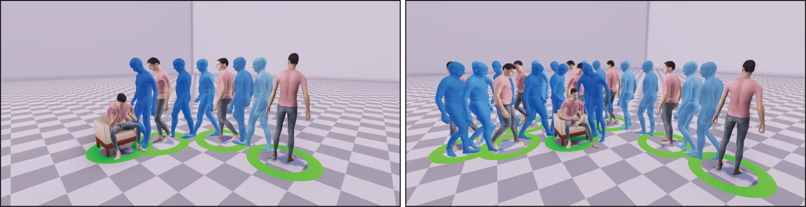

# Hierarchical Generation of Human-Object Interactions with Diffusion Probabilistic Models



> [Hierarchical Generation of Human-Object Interactions with Diffusion Probabilistic Models](https://zju3dv.github.io/hghoi) \
> Huaijin Pi, Sida Peng, Minghui Yang, Xiaowei Zhou, Hujun Bao \
> ICCV 2023

## TODOs

- [ ] Pretrained models. 

- [ ] Detailed training and testing guides. 

- [x] Release unity code. 

- [x] Release python code. 

## Citation


```
@InProceedings{Pi_2023_ICCV,
    author    = {Pi, Huaijin and Peng, Sida and Yang, Minghui and Zhou, Xiaowei and Bao, Hujun},
    title     = {Hierarchical Generation of Human-Object Interactions with Diffusion Probabilistic Models},
    booktitle = {Proceedings of the IEEE/CVF International Conference on Computer Vision (ICCV)},
    month     = {October},
    year      = {2023},
    pages     = {15061-15073}
}
```